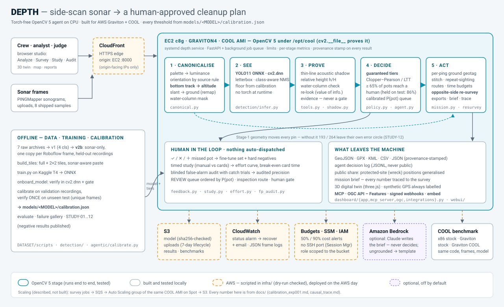

# DEPTH — architecture (as built)

**Related:** [`README.md`](README.md) · [`experiments.md`](experiments.md) · [`progress.md`](progress.md) ·
[`infra/README.md`](infra/README.md) · [`docs/agentic_vision.md`](docs/agentic_vision.md) · proposal of record
[`AGENT.md`](AGENT.md) (the as-built design below supersedes its Lambda/DynamoDB/Amplify/SageMaker plan)

DEPTH turns side-scan sonar frames into a **human-approved cleanup plan** for derelict fishing gear
(ghost pots) and wreck debris. Every find comes with evidence; the agent's tiers carry **calibrated
statistical promises**; every human decision is kept as a training label; and the whole thing runs
torch-free on **OpenCV 5**, CPU-only, on **AWS Graviton with COOL**.

## 1. Principles

1. **Promises, not guesses.** Thresholds are fit on held-out recordings with finite-sample bounds
   (Clopper–Pearson, Learn-Then-Test) and verified once on unseen test frames. If a promise is not
   achievable, the product says so.
2. **Measured, not assumed.** Every headline number names its data split; assumptions (analyst
   timings, ping rate, prices) are labelled and replaced by measurements as soon as they exist
   (the Study tab, the COOL benchmark, the audit).
3. **Human-gated.** Nothing is dispatched automatically; LOW-RISK items are kept for audit, never
   deleted.
4. **Publish what didn't work.** STUDY-01 (classical ROI gate), STUDY-03/04 (shadow as a filter),
   STUDY-07 (re-look vs confidence), STUDY-08 (range-gain input) are negative results kept in the
   record.
5. **One product, one deploy target.** The same FastAPI app runs locally and on the COOL server.

## 2. System at a glance



_Solid = built and tested; dashed amber = AWS, scripted in `infra/` and deployed on the AWS day;
dashed violet = optional. Text version:_

```
                              ┌──────────── OFFLINE ─────────────────────────────────────────────────┐
 7 raw archives ─► v1 (4 cls) ─► v2b: sonar-only, 2 cls, 1 copy per Roboflow frame, val = held-out
                  recordings, unique-frame test, official-398 + cross-sonar tests          (DATASET/scripts)
                  └► build_tiles.py (full + 2×2 tiles, sonar-aware copy-paste) ─► train.py (Kaggle T4)
                     └► <name>_complete.zip ─► onboard_model.py: verify cv2.dnn ─► models/<name>/
                        ─► calibrate (val recordings) ─► evaluate (test · official 398 · cross-sonar)
                              └──────────────────────────────────────────────────────────────────────┘
 RUNTIME (per frame, CPU, OpenCV 5)                                                  models/<MODEL>/calibration.json
  frame ─► STAGE 1  canonicalise: palette→luminance · orientation by source rule · bottom track
         │          (altitude px / ping) · slant→ground · water-column mask          src/cv_pipeline/canonical.py
         ─► SEE     YOLO11 ONNX via cv2.dnn · letterbox · class-aware NMS             src/detection/infer.py
         ─► PROVE   water_column_check · thin-line shadow · relative height (tracked altitude)
         │          · agent's-eye re-look view (display)                              src/agentic/{shadow,perception,tools}.py
         ─► DECIDE  guaranteed tiers (CONFIRMED / REVIEW / LOW-RISK) · value-of-information tool use
         │          · calibrated P(pot) · full trace                                  src/agentic/{agent,policy,guarantees}.py
         │   ACTIVE VISION (experimental switch; off by default - validation failed)  src/agentic/{active,evidence_model}.py
         │          detector belief ─► choose the cheapest OpenCV tool whose result could change the action
         │          (geometry 0 ms · shadow ~1 ms · zoom re-look ~0.4 s) ─► Bayes update (LRs fit on val)
         │          ─► conflict? ─► another observation (in-frame tool, else opposite-side pass) ─► ACCEPT / REVIEW / WATCH
         ─► ACT     geotag (ground range + own ping) ─┐                               src/agentic/geo.py
 SURVEY  frames ─► chunk stitching ─► repeat-sighting merge ─► recovery route · inspection route
                   · analyst budget · boat budget ─► opposite-side re-survey passes (ranked by information
                   per boat-minute; one approval per pass; a declined pass re-plans) ─► GeoJSON/GPX/KML/CSV/JSON
                   · WITH vs WITHOUT OpenCV counterfactual, live per survey   src/agentic/counterfactual.py
                                                            src/agentic/{pipeline,stitch,resurvey,mission}.py
 HUMAN LOOP  labels (✓ / ✕ / ＋missed) ─► fine-tune set     src/agentic/feedback.py
             timed study (manual vs cards) ─► effort curve  src/agentic/{study,effort}.py
             blinded false-alarm audit ─► audited precision src/detection/fp_audit.py
 SERVE   FastAPI (jobs, limits, rate limits, metrics) + zero-build studio (Analyze · Survey · Study · Audit · Connect)
         + MCP (/mcp) · OGC API – Features (/ogc) · signed webhooks · <depth-hazards> embed   src/dashboard/, webui/
 CLOUD   CloudFront ─► EC2 c8g (Graviton4) · COOL AMI · systemd ─► S3 · CloudWatch · Budgets · SSM   infra/
```

## 3. Stage 1 — sonar canonicalisation (`src/cv_pipeline/canonical.py`)

The classical ROI gate was retired (STUDY-01: it fires more on empty seabed than on debris). Stage 1
now **measures geometry** the later stages need, ~5 ms per 640² frame:

| step | output | used by |
|---|---|---|
| palette → luminance (HSV value for colour palettes) | `gray`, `palette` | shadow, bottom track |
| orientation by **source rule** (PINGMapper `*_ss_*` ⇒ nadir top), user override, else *unknown* — never guessed (the old auto-guess was right 26% of the time) | `orientation` | everything geometric |
| **bottom tracking** — first dip-then-rise after the transducer ring-down, per ping, median+mean along track | `altitude_px`, per-ping line | relative height, ground range, UI overlay |
| slant → ground: `sqrt(slant² − alt²)` (`cv2.remap` view) | `ground_range_px` | geotag |
| range-gain normalisation (detector-input option) | `gain` image | measured: no gain for EXP-001 → detector stays on `raw` |
| water-column mask | `in_water_column` | evidence card |

Validation without labels on 107 un-augmented originals (STUDY-08): port vs starboard on the same
pings agree to a median **1.6 px** (null 5.3 px); consecutive chunks 1.2 px; 97% tracked.

**Sensor cross-check** (`src/agentic/sensor_check.py`, STUDY-16 → `docs/sensor_check.md`, on by
default for raw recordings). Per 500-ping chunk the agent checks OpenCV's bottom track against the
depth sounder; on a conflict it re-runs the OpenCV tracker in a window the steady sounder sets
(`canonical.edge_picks` / `line_quality`), trusts a coherent image edge where the sounder lost lock,
re-tracks from the other channel, or withholds the geometry; then it re-fits the range scale from
sounder-backed chunks and re-checks until it converges. The accepted line reaches Stage 1 through
`Canonicaliser.apply_geometry`; a withheld one widens the geotag error by the altitude bound.

**Raw recordings** (`src/cv_pipeline/humminbird.py`, STUDY-14 → `docs/raw_recording.md`). A defensive
reader for Humminbird `.DAT` + `B00x.SON/IDX` (9xx/11xx/Helix and Solix):

* **Header walking and bounds.** It walks the tag-structured ping headers (the length is derived,
  never assumed) and bounds-checks every offset and count.
* **Corrupt input.** A corrupt ping is skipped with a recorded issue.
* **What it yields.** Per-ping GPS (Humminbird Mercator, as in PINGMapper), heading, speed, **depth**
  and 8-bit returns, plus 500-ping sonograms in the training layout.
* **Physics checks** against the PINGMapper sample:
  * GPS speed = 0.1 × the speed field, r = 0.95;
  * course vs heading median 2.4°;
  * the depth field is in decimetres.
* **Measured range scale.** It is the sonar depth (m) ÷ the Stage-1 altitude (samples), 2.19 cm/sample
  ± 14.5%. The uncertainty is the larger of the robust spread and the gap to beam physics.

## 4. See — the detector (`src/detection/infer.py`, `calibration.py`)

YOLO11s exported to ONNX and run by **`cv2.dnn`** (OpenCV 5 new engine with fallback), letterbox →
decode → class-aware `NMSBoxesBatched`. Everything model-specific comes from
`models/<MODEL>/calibration.json` (`$DEPTH_MODEL`, default EXP-003 since 2026-10-06): class names, input size,
per-class floors, the guaranteed class, detector input, tiers. Weights resolve from `$DEPTH_ONNX` →
`models/<MODEL>/best.onnx` → `runs/<MODEL>/weights/best.onnx`. Threads: `$DEPTH_THREADS`.

## 5. Prove — evidence per candidate

* **water_column_check** — is the box above the tracked seabed?
* **thin-line acoustic shadow** — PINGMapper shadows are 2–4 px lines; contrast is measured against
  same-size flank windows (selection-unbiased); CLEAR / WEAK / NONE. Evidence for the card, **not a
  gate** (AUC ≈ 0.6 true vs false detections — STUDY-03/06).
* **relative height** h/H = Ls/(R+Ls) against the **tracked** altitude, slant→ground corrected.
  Metres only with a measured altitude in metres (these frames carry no range scale).
* **agent's-eye view** — the exact re-look crop (zoom + CLAHE), display-only.

## 6. Decide — guaranteed tiers + value of information (`src/agentic/`)

`calibrate.py` fits, on the calibration recordings only:
* **τ_review** — the highest threshold whose Clopper–Pearson upper bound on the miss rate stays ≤ α
  (fixed-sequence LTT) → "≥ R% of pots reach a human (95%)"; never-proposed pots count as misses;
* **τ_confirm** — the lowest threshold whose lower bound on precision stays ≥ target → "≥ P% of
  CONFIRMED are real (95%)", or none;
* **P(pot)** bins for queue order and budget forecasts; seven scoring policies compared at the same
  promise, a re-look policy is adopted only with a significant paired-bootstrap gain.

EXP-003 (deployed): **≥ 79% of pots reach a human, held on test (81.1%, LCB 76.7%)**; 90% not
achievable (recall ceiling 0.85 on the calibration recordings).

EXP-001 (earlier): **≥ 65% of pots reach a human, held on test (86.2%, LCB 80.5%)**; 90% not achievable
(recall ceiling 0.72 on the calibration recording); no precision promise → nothing auto-confirmed;
re-look did not beat confidence (1 inference/frame). The agent re-looks only where it could change a
tier (value of information); every call — including the ones it chose not to make — is in the trace.

### 6b. Active vision — OpenCV result → decision → next tool → new evidence (`active.py`, `evidence_model.py`)

The agent holds a belief P(pot) per find (the calibrated detector-only value to start) and an ACTION:
**accept** (P ≥ 0.60: priority inspection target, dispatch still needs a person), **review**, or
**watch** (P < 0.15: end of the queue, still shown to a person). Tiers never change, so the recall
promise is untouched.

1. `geometry_check` — Stage 1 already measured it (0 ms). A box in the water column is an **evidence
   conflict** and is never accepted (a physical rule).
2. For each remaining tool, the agent computes the probability that its result **changes the action**
   (value of information) from likelihood ratios measured on the validation recordings
   (`models/<MODEL>/evidence_model.json`). It runs the **cheapest** tool with a non-zero chance —
   shadow check (~1 ms) before zoom re-look (~0.4 s) — updates P (Bayes, odds form) and asks again;
   it stops when nothing left can change the action. Tools it did not run are logged with the reason.
3. **Conflict** — an OpenCV result that pushes against the detector (down from accept/review, or up
   from watch) → another observation: the next informative in-frame tool, else an **opposite-side
   pass** (a person approves it).
4. No orientation (source rule) → no shadow tool (never guessed).

**Validation (honest):** fit on val, verified once on test, then a fresh cross-sonar split. On test the
evidence made ACCEPT more precise (67% → 73%) and left fewer real pots at the bottom (49 → 36), but
both registered gates **failed** — test log-loss 0.637 → 0.648, and on `test_xsonar` ACCEPT precision
0.86 → 0.848 with more real targets in WATCH (127 → 161). So it is **off by default** and the studio
runs it only behind the **Active vision · experimental** switch (`?active=1`; `DEPTH_ACTIVE=off`
disables it). Report: [`docs/evidence_model_exp003.md`](docs/evidence_model_exp003.md).

## 7. Act — survey level (`src/agentic/pipeline.py`, `resurvey.py`, `mission.py`, `geo.py`)

* **geotag** — no GPS ⇒ no coordinates (honest). With a track: each object gets its **own ping**
  (along-track offset from the frame-centre fix) and its **ground** range; error radius shown. With a
  **real recording**:
  * the position comes from the object's own ping GPS fix and heading;
  * the distance is the Stage-1 ground range × the measured scale;
  * the error radius is 3 m GPS (assumed) + range × (scale uncertainty + sin 6°, the measured p90 heading error);
  * heights are in metres, from the sonar's measured depth.
* **chunk stitching** — an object cut by a chunk boundary is one hazard.
* **repeat-sighting merge** — different-frame, same-class detections whose error circles overlap
  (tight gate; closest first; never two detections of one frame) → one hazard with `sightings`.
* **routes** — nearest-neighbour recovery route (CONFIRMED) and inspection route (budgeted REVIEW).
* **analyst budget** — which cards fit N minutes and the expected real pots (Σ P(pot)).
* **opposite-side re-survey** — for each uncertain target, a pass on the far side with the target at
  mid-swath; aligned targets share a pass; passes ranked by **information gained per boat-minute**
  (expected bits of one more shadow view with active vision, Σ p(1−p) otherwise) — the most
  informative target drives the plan, not the most confident; boat-time budget; each target predicts
  the bearing its shadow must flip to. Each pass is its own approval request ("Agent recommends:
  Perform opposite-side resurvey · Reason: …"). **Declined** → never proposed again, the boat time is
  re-ranked over the remaining passes and its targets move to the front of the inspection queue.
* **WITH vs WITHOUT OpenCV** (`counterfactual.py`) — every survey re-plans itself with the OpenCV
  outputs removed (detector action, slant-range pins) and diffs decision, priority, geolocation,
  re-survey route and approvals; shown in the Agent tab ([`docs/opencv_counterfactual.md`](docs/opencv_counterfactual.md)).
* **exports** — GeoJSON / GPX / KML / CSV / JSON, synthetic GPS always labelled; every format but CSV
  carries the provenance stamp; `trace` = the agent decision log (JSONL, never public); `?public=1`
  generalises protected-site (wreck) positions.
* **Stage-1 counterfactual** (`geo.stage1_counterfactual`) — every GPS survey also reports where each
  pin would land without Stage 1 (slant range, frame-centre ping; no re-inference) and how many leave
  their own error circle — STUDY-12 live; the map's "⊘ without Stage 1" toggle draws it.
* **mission brief** (`brief.py`) — a one-page hand-over written from a compact facts JSON *after* every
  decision. Deterministic template always; optional Claude on Amazon Bedrock (`DEPTH_BRIEF_LLM=bedrock`)
  whose text is accepted only if every number / ID is a survey fact and the mandatory caveats are
  present — else the template is served. The LLM never sees coordinates and never changes a decision.

## 8. Human in the loop

| tool | what it measures / produces | where |
|---|---|---|
| **person-confirmed loop** | a named person's ✓ / ✕ on a card, then the crew's *recovered* / *not found* → the agent **re-plans** (recovery route, queue, budget, re-survey passes); the agent's verdict is never overwritten; every decision logged; **impact ledger** with the reviewed precision (Clopper–Pearson 95%) | `mission.apply_human / plan_mission`, `POST /api/survey/{id}/decide`, Survey table |
| labels | ✓ real / ✕ not a pot / **＋ missed pot** → append-only log → YOLO fine-tune set + hard negatives; reviewer agreement vs GT | `feedback.py`, Analyze + Survey |
| timed study | counterbalanced 2×2 Latin square, manual review vs DEPTH cards, scored vs labels → s/frame, s/card, recall both ways | `study.py`, Study tab |
| effort curve | recall vs analyst minutes: manual / detector list / DEPTH queue; promise point; **break-even card time** (7.95 s at 20 s/frame); forecast vs actual (84.5 vs 90) | `effort.py`, Study tab |
| false-alarm audit | blinded, with catch trials; exact audited precision in the conf ≥ 0.176 band; taxonomy; κ | `fp_audit.py`, Audit tab |

## 9. Serving (`src/dashboard/`, `webui/`)

| endpoint | purpose |
|---|---|
| `GET /api/health` | OpenCV version + `cv2.__file__` (COOL provenance), model state, calibration summary, limits, jobs |
| `GET /api/metrics` | rolling per-stage p50/p95 on this host + arch / EC2 type / COOL |
| `POST /api/analyze` | one frame → Stage 1 + evidence cards + traces (+ `frame_ref` for labels) |
| `POST /api/jobs/survey`, `GET /api/jobs/{id}` | background survey jobs (no proxy timeouts) with progress; `gps=synthetic \| none \| recording` (the raw recording with real GPS) |
| `GET /api/recording` | the raw recording available as a survey source, with its physics checks and measured range scale |
| `POST /api/survey/{id}/decide` | a named person's confirm / reject / recovered / not_found / undo → the agent re-plans |
| `GET /ogc/…` | OGC API – Features: `hazards`, `resurvey_passes`, `routes`, `work_orders` (paging, bbox, `survey_id`, `public`) |
| `/api/integrations[/webhooks]` | integration overview; signed webhook registry, test sends, delivery log (admin token) |
| `POST /mcp` | MCP (Streamable HTTP, stateless, JSON) — the same 13 tools as `python -m src.dashboard.mcp_server` (stdio); bearer `DEPTH_MCP_TOKEN` |
| `GET/POST /api/approvals` · `POST /api/approvals/{id}/decide` | human-approval requests: agents ask, a named person decides (append-only log) |
| `GET /api/brief?survey_id=` | the mission brief + `writer` (template / llm), `grounding` report, `fallback_reason`, the facts it was written from |
| `GET /api/report/{fmt}` | mission exports (persisted) — **brief** (markdown) · geojson · gpx · kml · csv · json · **trace** (agent decision log, JSONL); `?public=1` generalises protected-site locations; every format but CSV carries the **provenance stamp** |
| `POST /api/feedback`, `GET /api/feedback/stats` | human labels |
| `/api/study/*`, `GET /api/effort` | timed study + effort curves |
| `/api/audit/*` | blinded audit |

Hardening:

* **Inference:** plain-`def` endpoints (thread pool), with one `cv2.dnn` lock held per frame.
* **Uploads:** images only, ≤ 20 MB, ≤ 50 frames.
* **Load:** per-client rate limits on the expensive endpoints (`ratelimit.py`, 429 + Retry-After) and a
  survey-queue cap (503).
* **Access:** CORS off unless configured; bearer token on `/mcp`; admin token for webhooks.
* **Startup:** the model is warmed at startup.
* **Map:** Leaflet vendored (SRI-checked); keyless basemaps with an offline grid fallback.

UI: a zero-build studio with five modes (Analyze · Survey · Study · Audit · Connect)
(`webui/styles.css`, `webui/app.js`).

- **Look:** Apple-style dark materials in deep-ocean tones: three floating glass layers over
  near-black navy and a faint static nautical chart. The wordmark has no icon. The depth contours are
  made with OpenCV (`webui/img/make_bathymetry.py`). Marine palette: aqua is the single call to
  action; seafoam / sand / slate / coral mark the verdicts. It is synced with `app.js` and `twin3d.js`.
- **Type:** Apple devices get the real **SF Pro**. It is the system font and may not be
  redistributed, so everyone else gets **Inter** (vendored, OFL), the closest open match, with no
  stylistic alternates. **Sentence case everywhere**: no all-caps, and no raw `snake_case`, because
  one `human()` formatter displays class and verdict names. The type uses on a fixed scale (11 / 12 / 13 / 14 / 16 / 20 /
  28 px) with Inter's size-dependent tracking, weights 400 / 500 / 600, tabular figures for numbers.
  **JetBrains Mono** is used only for code and the agent log.
- **Progressive disclosure** — what an analyst needs is visible; the rest is one click away:
  - system status is one indicator, with details in a popover;
  - class filters, "mark a missed pot" and the confidence gate sit behind small popovers;
  - evidence is a compact row per find, and the selected find opens into its full card;
  - the right column shows tabs when a mode has several sections (survey: Brief · Hazards ·
    Approvals · Exports · Effort);
  - the guarantee and model sections fold to a one-line summary, and advanced survey options fold
    away;
  - panel explanations sit behind an (i), and the agent log opens from a slim status dock.
- **Loading:** one controller (`Busy`) for every long action.
  - A hairline progress bar sits on the navigation's lower edge. It is determinate when the server
    reports progress (survey frames) and an indeterminate sweep otherwise.
  - A quiet status pill states the step in words ("Frame 4 of 8").
- **Performance and robustness:**
  - one font file (48 KB) is preloaded;
  - images use lazy loading and async decoding;
  - `content-visibility` skips rendering evidence rows that are off screen;
  - the background is static (no animated layers under the blur);
  - `/vendor/` and `/img/` are cached for a week, while the app shell revalidates on every load;
  - fallbacks are provided for `prefers-reduced-motion`, `prefers-reduced-transparency` and missing
    `backdrop-filter`.

## 10. Cloud + COOL (`infra/`)

EC2 **c8g.xlarge** from the **COOL AMI** (OpenCV 5 under `/opt/cool`), `systemd` unit running the
app with the COOL interpreter (web deps via `pip --target`; the COOL venv is never modified), behind
**CloudFront** (HTTPS; security group open only to CloudFront's origin-facing prefix list; no SSH —
SSM), **S3** (models, uploads with 7-day expiry, results, benchmarks), **CloudWatch** (status-check
auto-recover + email; JSON frame logs), **Budgets** alarm first. `deploy_aws.sh` is dry-run by
default. The **3-way benchmark** (x86 stock · Graviton stock · Graviton COOL) times the product
workload per stage with pinned threads and reports $/1k frames and $ + real-time factor per
survey-hour; a run is labelled COOL only if `cv2` loads from `/opt/cool`. Local x86 reference:
238 ms/frame p50; one survey-hour in 43 s (RTF 0.012).

Scaling (described, not built): survey jobs → SQS → an Auto Scaling group of the same COOL AMI
workers (Spot) → S3.

## 11. Data + models

| dataset | role |
|---|---|
| v1 (4 classes, 29k images) | trained EXP-001 (the earlier model); its unseen crab-pot sonograms (v1 val Rec19, v1 test) host EXP-001's calibration/verification |
| **v2b** (2 classes, sonar only, deduped) | EXP-002–005 (EXP-003 deployed); the shipped demo frames are v2b test frames: val = held-out recordings Rec10/12/16; test = 214 unique crab-pot frames; `test_official398` (GhostVision head-to-head); `test_xsonar` (orange Contact crops) |

EXP-002 (1024 px and a 640-px twin, full frames + tiles) ran on Kaggle and was **rejected on
validation** (ghost AP 0.25). It was underfit, because `optimizer=auto` silently swapped in AdamW at lr
0.00167, and the tiles left cut objects unlabelled ([`docs/exp002_diagnosis.md`](docs/exp002_diagnosis.md)).
EXP-003 fixes both: explicit SGD and fixed tiles, with a tiles vs full-frames arm at 640 px
([`docs/kaggle_training.md`](docs/kaggle_training.md)). `python -m src.detection.diagnose` now checks every new
model on validation per source and on its own training frames before onboarding. Onboarding
times each model against EXP-001 (`--max-ms`); STUDY-13 showed resolution must be chosen on held-out
recordings.

| external data | role |
|---|---|
| PINGMapper sample `Test-Small-DS` (R01224, Humminbird 9xx, Colorado River, 150.6 s) | the raw-recording path with real GPS (STUDY-14). Fetched and hash-pinned, never redistributed. |

Weights: `python -m src.detection.fetch_model` (GitHub Release `exp001-v1`, SHA-256 checked).

## 12. Code map

```
src/cv_pipeline/  canonical.py (Stage 1) · humminbird.py (raw recordings, STUDY-14) · orientation.py ·
                  study_canonical.py (STUDY-08) · pipeline.py (retired ROI gate, STUDY-01 record)
src/detection/    infer.py · calibration.py · evaluate.py · export_onnx.py · train.py ·
                  onboard_model.py · fetch_model.py · fp_audit.py · frames.py · error_analysis.py ·
                  tiled_infer.py · failure_gallery.py · seam.py · study_seam.py (11b) · study_scale_tta.py (13)
src/agentic/      agent.py · perception.py · shadow.py · tools.py · evidence.py · policy.py ·
                  guarantees.py · calibrate.py · geo.py · stitch.py · resurvey.py · mission.py ·
                  pipeline.py · approvals.py · feedback.py · study.py · effort.py · twin.py (3D twin) ·
                  provenance.py · brief.py (mission brief) · study_causal.py (STUDY-12) · types.py
src/bench/        product_bench.py · fingerprint.py · compare.py (COOL benchmark)
src/dashboard/    app.py · jobs.py · metrics.py · samples.py · mcp_server.py · ogc.py · integrations.py ·
                  ratelimit.py
webui/            index.html · app.js · twin3d.js (three.js twin) · styles.css · embed/depth-embed.js ·
                  samples/ (8 CC-BY-SA frames) · audit/ · vendor/leaflet · vendor/three
infra/            deploy_aws.sh · setup_cool_instance.sh · depth.service · bench_cool.sh
models/<MODEL>/   calibration.json · effort_curve.json · fp_audit_val.json (weights: fetch_model)
DATASET/scripts/  audit_dataset · build_dataset_v1/v2/v2b · build_tiles · visualize_labels
.github/          workflows/tests.yml (CI)
```

## 13. Known limits (stated in the product)

* Recall ceiling: EXP-003 reaches 0.85 on the calibration recordings, so the promise is 79%, not 90%. Five
  later runs did not beat it; the limit is data (3 validation recordings, label noise), not the recipe.
* No precision promise yet → every find goes to a human.
* Synthetic GPS for the shipped crab-pot frames (the HF frames carry none). The raw recording has
  real GPS and a measured scale, but it is a river with no known pots (a false-alarm measurement, not a
  recall one).
* Minutes saved and label noise are **pending human measurements** (Study, Audit).
* COOL numbers pending the EC2 runs; the local reference is x86.
