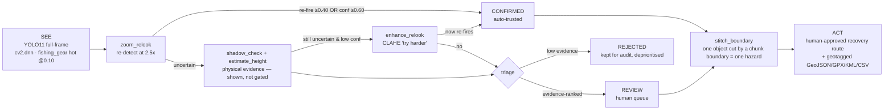

# Agentic Vision entry — See · Prove · Decide · Act

**Marine-debris (ghost-gear) detection in side-scan sonar · Team Syndicate**

> A chatbot that *explains* results does not qualify. This system qualifies because **the picture
> result changes the agent's next step**: what the agent measures on a candidate decides which tool
> it calls next, when it stops, and whether a human is asked. Everything is logged, calibrated, and
> human-gated.

Code: [`src/agentic/`](../src/agentic) · Live demo: the web app (`webui/`, served by
`src/dashboard/app.py`) · Evidence: `python -m src.agentic.calibrate` → `runs/prove/`.

---

## 1. The loop



- **SEE** — `perception.Perceptor.perceive` runs YOLO11 through OpenCV 5 `cv2.dnn` (no torch). The
  mission-critical `fishing_gear` class runs at a hot 0.10 threshold to catch small crab-pots (recall
  0.47→0.69), trading precision that the agent then repairs.
- **PROVE** — for each candidate the agent gathers *physical + consistency* evidence: re-look
  persistence (zoom in and re-detect — a real object re-fires, speckle does not), the acoustic
  **shadow** where it exists (+ a height *relative to sonar altitude*), and echo strength. The frame
  orientation comes from a **source rule** (`src/cv_pipeline/orientation.py`), never a guess.
- **DECIDE** — an adaptive controller (below) selects tools by evidence and triages into
  **CONFIRMED / REVIEW / REJECTED**, recording every tool call.
- **ACT** — CONFIRMED hazards become a nearest-neighbour **recovery route** + geotagged reports;
  a human must approve before anything is "dispatched".

---

## 2. The toolbox (`tools.py`)

Each tool returns `(payload, AgentStep)` — the result the agent reasons over, plus a timed,
human-readable trace entry.

| Tool | What it does | Drives the next step by… |
|---|---|---|
| `detect` | full-frame YOLO11 (`cv2.dnn`) | producing the candidate set |
| `zoom_relook` | crop + 2.5× upscale + re-detect | re-fire ⇒ confirm; no re-fire ⇒ escalate |
| `enhance_relook` | CLAHE contrast boost, then re-look | a "try harder" pass for uncertain candidates |
| `shadow_check` | measure the acoustic shadow (contrast, run) | physical evidence + quality for the card |
| `estimate_height` | relative height from shadow geometry `h/H = Ls/(range+Ls)` | plausibility evidence; metres only with a *measured* altitude |
| `stitch_boundary` | link an object cut by a chunk boundary (same range, adjacent chunks) | counts it once in the route/report; never changes a verdict |

The rule core (`policy.py`) is the **sole decision authority** — deterministic, reproducible,
human-gated. An LLM narrator (e.g. Bedrock) could sit on top to write the mission brief without ever
touching the safety-critical logic.

---

## 3. Autonomy — the perception result changes the next step

`agent.ReLookAgent._decide_candidate` is an **adaptive escalation ladder**, not a fixed script.
Different candidates take different paths and stop at different depths:

```
1. zoom_relook                       ← the agent's first probe
   confident? (re-look ≥0.40 OR detector conf ≥0.60)
2. shadow_check → estimate_height    ← physical evidence for the card (always, cheap)
3. IF still uncertain AND low conf:  ← ESCALATE only when it will help
      enhance_relook (CLAHE)         ← the "try harder" pass; SKIPPED once confident
4. decide → CONFIRMED / REVIEW / REJECTED   (records which CONFIRMED path won)
5. (survey) stitch_boundary          ← one object split across adjacent chunks = one hazard
```

Two real traces the award asks for (captured in `runs/`):

- **A re-look *changed* the decision.** A conf-0.18 candidate did not re-fire on the first zoom, but
  the agent's CLAHE "try harder" pass re-fired it at **0.54 → auto-CONFIRMED**. The perception result
  drove the escalation and flipped the outcome.
- **The agent stopped early.** A conf-0.68 candidate is auto-confirmed on the high-confidence path and
  the expensive enhanced re-look is **skipped** — the agent does not waste a second inference on a
  settled call.

---

## 4. Calibrated, honest decision policy (STUDY-03 / STUDY-04)

Measured on the real crab-pot test split — reproduce with
`python -m src.agentic.calibrate --frames 160 --out runs/prove`.

| Tier | Rule | Precision | Share of true pots |
|---|---|---:|---:|
| raw hot detector | fishing_gear @conf 0.10 | 0.599 | 100% |
| **CONFIRMED** | `re-look ≥ 0.40` **OR** `conf ≥ 0.60` | **0.737** | 30% |
| REVIEW | everything else | 0.55 | 61% |
| REJECTED | `conf < 0.15` **and** `re-look < 0.12` | 0.56 | 9% (kept for audit) |

**By CONFIRMED path:** re-look 0.71 · high-confidence 0.92 · both 0.70. The union beats the
re-look-only tier (0.713 / 26%) on **both** precision and recall.

**Why the shadow is not a gate (honesty).** On this data a *measurable* shadow exists only on a
minority of objects, and its CLEAR-rate is **14.5% on true vs 14.6% on false** detections —
statistically identical, i.e. non-discriminative. Gating on it *lowers* precision (0.69→0.40). So the
shadow is **shown as evidence + a height estimate** (great for the report/UX, and true where it
exists), never used to silently accept or reject. This is the same discipline as STUDY-01 (we publish
the cue that *didn't* work).

---

## 5. Failure handling & human control (recall-safe by design)

- **Nothing is ever deleted.** REJECTED means "low evidence — deprioritised, retained for audit". The
  CONFIRMED+REVIEW tiers retain **~91%** of true pots; a human can still see the rest.
- **REVIEW is the human queue,** ranked by `evidence_score`, with per-row **approve/reject** in the
  dashboard (the correction can later become a training label — closes the loop).
- **No auto-dispatch.** Every `MissionPlan` carries `human_approval_required = True`.
- **Honest geotagging.** Coordinates are attached only when real per-ping GPS exists; otherwise
  `gps_available = False` and the UI says so. Demo tracks are stamped `SYNTHETIC DEMO GPS`.
- **Known limits:** the model is trained on one bay's crab-pots + one sonar brand; optical debris is
  out of domain; orientation is only known for PINGMapper sonograms (other sources: shadow not
  measured). The old "cross-pass corroboration" was removed — adjacent chunks image *different*
  seabed, so its matches were coincidences. All stated, none hidden.

---

## 6. Mapping to the Agentic-Vision rubric

| Criterion | Weight | Where it's met |
|---|---:|---|
| OpenCV 5 + agent doing real work | 30% | `cv2.dnn` detect + OpenCV shadow/CLAHE/zoom; the agent's tools *are* CV ops |
| Orchestration & autonomy | 25% | adaptive escalation ladder, early-stop, tool selection by evidence (§3) |
| Task success | 20% | CONFIRMED precision 0.737 @ 30% recall (§4); a real recovery route in the demo |
| Failure handling & human control | 15% | recall-safe REJECTED, REVIEW queue, human-approval gate (§5) |
| User experience | 10% | one-click dashboard: stepper, evidence cards, trace panel, map, downloads |

**Reproduce the evidence:** `python -m src.agentic.calibrate` (tiers + per-path precision + the
shadow statistic) · `python -m src.agentic.pipeline --survey <dir>` (full loop → overlays + reports)
· `pytest -q` (incl. the stitching test that asserts it never changes a verdict).
