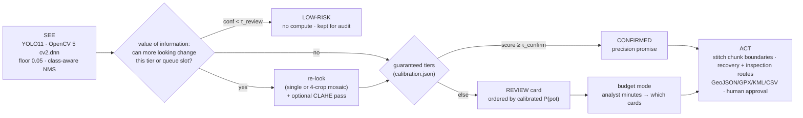

# Agentic Vision entry — See · Prove · Decide · Act

**Marine-debris (ghost-gear) detection in side-scan sonar · Team Syndicate · DEPTH**

> A chatbot that *explains* results does not qualify. DEPTH qualifies because **the picture result
> changes the agent's next step**, under a **stated objective**: meet two calibrated promises — how
> many pots reach a human, and how many auto-confirmed finds are real — while spending the least
> compute and the fewest human minutes. Every decision is logged, every tier is calibrated on held-out
> data, and a human approves every action.

Code: [`src/agentic/`](../src/agentic) · Live demo: the web app (`webui/`, served by
`src/dashboard/app.py`) · Evidence: [`docs/calibration_exp001.md`](calibration_exp001.md)
(regenerate with `python -m src.agentic.calibrate`).

---

## 1. The loop



- **SEE** — `perception.Perceptor` runs YOLO11 through OpenCV 5 `cv2.dnn` (no torch), with
  class-aware NMS. Every threshold comes from one file, `models/<MODEL>/calibration.json`.
- **PROVE** — per candidate, *only when it can matter*: a zoom-in **re-look** (single crop, or 4 crops
  packed into one inference), a CLAHE "try harder" pass, the thin-line **acoustic shadow** and a
  **relative height** (orientation from a source rule — never guessed). Evidence is always shown on
  the card; the shadow is never a filter.
- **DECIDE** — **guaranteed tiers** (§4): CONFIRMED / REVIEW / LOW-RISK, with thresholds fit by
  Clopper–Pearson / Learn-Then-Test on held-out frames. The agent spends re-look compute only where it
  can change a tier or a REVIEW-queue position, and records the calls it chose *not* to make.
- **ACT** — chunk-boundary **stitching** (one object cut by a chunk edge = one hazard), a
  nearest-neighbour **recovery route** (CONFIRMED) and **inspection route** (the budgeted REVIEW
  cards), honest geotags, exports. Nothing is dispatched without a human.

---

## 2. The toolbox (`tools.py`)

Each tool returns `(payload, AgentStep)` — the result the agent reasons over, plus a timed,
human-readable trace entry.

| Tool | What it does | Drives the next step by… |
|---|---|---|
| `detect` | full-frame YOLO11 (`cv2.dnn`, class-aware NMS) | producing the candidate set |
| `relook_band` / `zoom_relook` / `mosaic_relook` | crop + upscale + re-detect (1 or 4 crops per inference) | lifting or vetoing the calibrated score, where it can change the outcome |
| `enhance_relook` | CLAHE contrast boost, then re-look | a "try harder" pass, only if calibration showed it helps |
| `shadow_check` | darkest 3-px shadow line vs flank-referenced background | physical evidence for the card (never a gate) |
| `estimate_height` | `h/H = Ls/(R+Ls)` — relative to sonar altitude | plausibility evidence; metres only with a *measured* altitude |
| `stitch_boundary` | same range, adjacent chunks, touching edges | counts a split object once; never changes a verdict |

The rule core (`policy.py`) is the **sole decision authority** — deterministic, reproducible,
human-gated. An LLM narrator could write the mission brief from the JSON without touching it.

---

## 3. Autonomy — a stated objective and value-of-information tool use

`agent.ReLookAgent._decide_calibrated` asks, for every candidate, *"can more looking change this
outcome?"* (`policy.GuaranteedTiers.needs_relook`):

```
conf < τ_review                → LOW-RISK, no compute ("a re-look cannot lift it into review")
conf ≥ τ_confirm (lift mode)   → CONFIRMED, no compute ("already above τ_confirm")
score depends on the re-look   → re-look (4 crops / inference in mosaic mode) → maybe CLAHE pass
otherwise                      → REVIEW card, no compute; P(pot) from the calibration
then: shadow + relative height for the card (cheap, no inference) → decide → trace
survey: stitch boundaries → REVIEW queue by P(pot) → budget plan → routes → human gate
```

**Budget mode.** Given "the analyst has N minutes", the agent orders the REVIEW queue by calibrated
P(pot), reports how many cards fit and the expected number of real pots they contain
(`mission.plan_budget`), and routes an **inspection route** through them. Seconds-per-card is
*assumed* (8 s) until the timed user study measures it.

**What the measurements decided (EXP-001).** The calibration compared seven policies — plain detector
confidence and six re-look variants — at the same recall promise. **None beat plain confidence
significantly on the calibration split**, and on the verification split confidence ranked best (AUC
0.764 vs 0.65–0.71 for every re-look variant). So, for this model, the agent's value-of-information
rule spends **no re-look inference on tiering: 1 inference per frame** (the old ladder spent 4–7).
The re-look stays as a display-only "agent's eye" view on each card. The same machinery re-decides
automatically for EXP-002.

---

## 4. Guaranteed tiers — calibrated on validation, verified once on test

Full, regenerable report: [`calibration_exp001.md`](calibration_exp001.md). EXP-001's only unseen
crab-pot sonograms are v1 val (**66 unique frames**, calibration) and v1 test (**92 unique frames**,
verification); Roboflow copies are removed.

| Promise (95% confidence) | Requested | What EXP-001 can support | Verified on test |
|---|---|---|---|
| **Recall** — pots that reach a human (CONFIRMED+REVIEW) | ≥ 90% | **≥ 65%** — 90% is impossible: the detector never proposes 28% of calibration pots (ceiling 0.72) | **held** — 86.2% (lower bound 80.5%) |
| **Precision** — CONFIRMED finds that are real | ≥ 85% | **none** — the best any threshold supports is ~62–66% | — (nothing auto-confirmed) |

So with EXP-001 **every find goes to a human**, in P(pot) order. That is the honest consequence of the
guarantee machinery, and it is the quantitative case for EXP-002: raising the proposal ceiling is the
only lever that can raise the recall promise, and a better-separated score is the only way to earn an
auto-confirm tier.

**The old headline, re-scored on unseen data.** The previous rules (re-look ≥ 0.40 OR conf ≥ 0.60,
tuned on the test frames) claimed CONFIRMED precision 0.737. On the unseen splits they give
**0.588 (calibration) and 0.578 (verification)** — they are retired.

**Why the shadow is not a gate.** Thin-line shadow AUC, true vs false detection: **0.60** on the
verification split (random seabed vs real pots: 0.57, STUDY-06). The detector's false positives are
mostly real 3-D returns too, so a shadow proves "something stands up", not "it's a crab pot". It is
shown as evidence with a relative height, never used to accept or reject.

---

## 5. Failure handling & human control

- **Nothing is ever deleted.** LOW-RISK = "below τ_review — retained for audit". Its size is bounded
  by the recall promise.
- **REVIEW is a budgeted human queue** ordered by calibrated P(pot), with per-row approve/dismiss.
- **No auto-dispatch.** Every `MissionPlan` carries `human_approval_required = True`; the inspection
  route is labelled "pending human approval".
- **Honest geometry.** Orientation comes from a source rule (PINGMapper sonograms: nadir at the top);
  unknown sources are *not measured* rather than guessed. Geotags need real GPS; demo tracks are
  stamped `SYNTHETIC DEMO GPS`; unknown orientation ⇒ swath-wide error radius.
- **Known limits (stated, not hidden):** one bay's crab pots and one sonar brand; calibration is a
  single recording (hence the separate verification split); labels are incomplete, so precision is a
  lower estimate; seconds-per-card is assumed until the user study.

---

## 6. Mapping to the Agentic-Vision rubric

| Criterion | Weight | Where it's met |
|---|---:|---|
| OpenCV 5 + agent doing real work | 30% | `cv2.dnn` detect + OpenCV re-look/mosaic/CLAHE/shadow; the agent's tools *are* CV ops |
| Orchestration & autonomy | 25% | stated objective; value-of-information tool use; budget mode; stitching; routes (§3) |
| Task success | 20% | a recall promise that **held on unseen test** (86%); honest "no auto-confirm" where the data can't support one (§4) |
| Failure handling & human control | 15% | bounded LOW-RISK tier, budgeted REVIEW queue, human-approval gate (§5) |
| User experience | 10% | studio UI: guarantee badges, evidence cards with the tier promise, effort panel, map + routes, downloads |

**Reproduce:** `python -m src.agentic.calibrate` (fit + verify + report + `calibration.json`) ·
`python -m src.agentic.pipeline --survey <dir>` · `pytest -q`.
