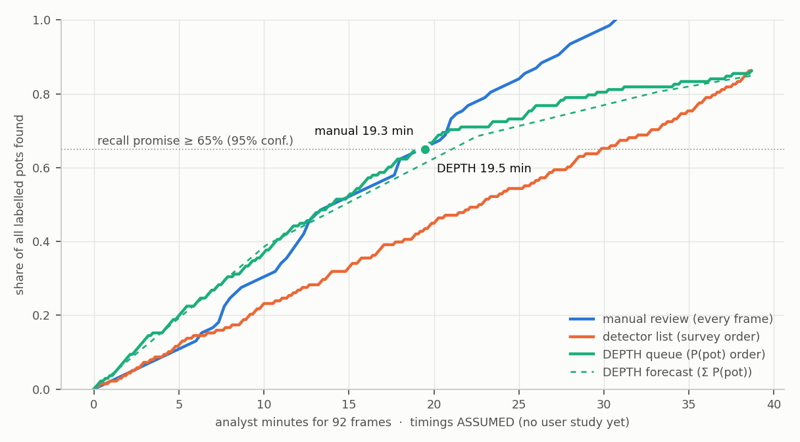

# Analyst effort — recall of pots vs review minutes

_`python -m src.agentic.effort` · model EXP-001 · verification split: `DATASET/03_yolo_ready_dataset_v1/test` crabpot_*wcp_ss_*.jpg — 92 unique frames, recordings ['Rec10', 'Rec3', 'Rec4', 'Rec6']_

Timings: **ASSUMED (no user study yet)** — 20 s per frame (manual), 8 s per card, manual recall 1.00, card accuracy 1.00.

| at the recall promise (≥ 65%) | manual review | DEPTH queue |
|---|--:|--:|
| analyst minutes for these 92 frames | 19.3 | 19.5 |
| per survey-hour of sonar (~169 frames) | 35.5 | 35.7 |
| cards reviewed | — | 146 |

**Break-even card time: 7.95 s.** DEPTH reaches the promise faster than manual review whenever reviewing one card takes less than this — it does not depend on the card timing, only on the manual seconds per frame and how many cards the promise needs. The timed study (`Study` mode) measures both.

**Forecast vs actual:** at the promise point the agent forecast **84.5** real pots from its calibrated P(pot); **90.0** were real — this is what budget mode tells an analyst *before* they spend the minutes.

Honesty notes:
- For EXP-001 the calibrated order equals confidence order (STUDY-07); DEPTH's gain over a sorted list is the stop rule (the promise) and the forecast, not the ranking.
- The verification split is pot-dense (every frame has at least one pot). A real survey-hour is mostly empty seabed: manual review still pays per frame, the queue pays per detection.
- Manual recall of 1.0 is an optimistic assumption for manual review; the study measures it.

---
_Regenerated by the script; do not edit by hand._
