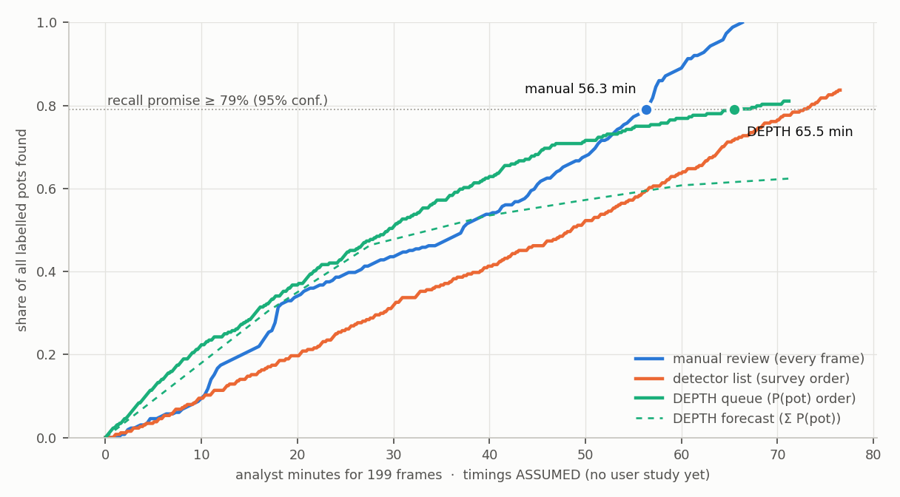

# Analyst effort — recall of pots vs review minutes

_`python -m src.agentic.effort` · model EXP-003 · verification split: `DATASET/03_yolo_ready_dataset_v2b/test` *wcp_ss_*.jpg — 199 unique frames, recordings ['Rec14', 'Rec8', 'Rec9']_

Timings: **ASSUMED (no user study yet)** — 20 s per frame (manual), 8 s per card, manual recall 1.00, card accuracy 1.00.

| at the recall promise (≥ 79%) | manual review | DEPTH queue |
|---|--:|--:|
| analyst minutes for these 199 frames | 56.3 | 65.5 |
| per survey-hour of sonar (~169 frames) | 47.8 | 55.5 |
| cards reviewed | — | 491 |

**Break-even card time: 6.88 s.** DEPTH reaches the promise faster than manual review whenever reviewing one card takes less than this — it does not depend on the card timing, only on the manual seconds per frame and how many cards the promise needs. The timed study (`Study` mode) measures both.

**Forecast vs actual:** at the promise point the agent forecast **162.5** real pots from its calibrated P(pot); **209.0** were real — this is what budget mode tells an analyst *before* they spend the minutes.

Honesty notes:
- EXP-003's calibrated policy orders cards by detector confidence (`baseline_conf`, STUDY-07); DEPTH's gain over a sorted list is the stop rule (the promise) and the forecast, not the ranking.
- The verification split is pot-dense (159 of 199 frames have at least one pot). A real survey-hour is mostly empty seabed: manual review still pays per frame, the queue pays per detection.
- Manual recall of 1.0 is an optimistic assumption for manual review; the study measures it.

---
_Regenerated by the script; do not edit by hand._
