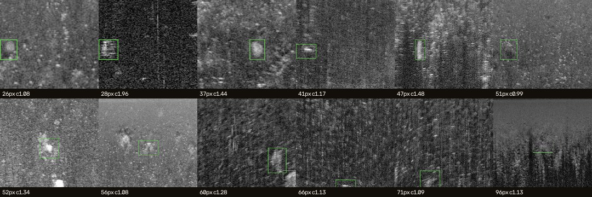
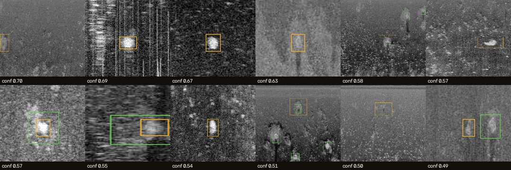

# Failure gallery — what EXP-001 gets wrong on unseen frames

_`python -m src.detection.failure_gallery` · EXP-001 · verification split `test` (92 unique frames, 138 labelled pots) · detector floor 0.05 · match IoU ≥ 0.3_

## Missed pots — 19 of 138 (14%) never reach a human

Green = the labelled pot; grey = any candidate that touched it (below IoU 0.3). Caption: size (px), local contrast (box mean ÷ ring mean).

| measured on every labelled pot | missed (median) | found (median) |
|---|--:|--:|
| size, longest side (px) | 52.0 | 36.0 |
| local contrast (box ÷ ring) | 1.17 | 1.34 |
| slant range (row, px) | 379.0 | 322.5 |
| **touches the frame edge** (chunk boundary or augmentation crop) | 32% | 11% |
| degenerate label (≤ 4 px thin) | 0% | 0% |

**Reading (data-driven):** **32% of the missed pots touch the frame edge** vs 11% of the found ones — objects cut by the frame edge are the largest single failure mode. The edge is a chunk boundary OR a Roboflow crop (most of these frames are augmented copies); seam inference across chunk boundaries did NOT recover them (STUDY-11b), which points at crop edges — a dataset artefact v2b removes by keeping one un-cropped copy per frame; missed pots are **lower-contrast** (1.17 vs 1.34) and **farther in range** (row 379.0 vs 322.5) — range fall-off; training on Stage-1 range-gain-normalised frames targets these; they are **not smaller** (52.0 vs 36.0 px) — the 'small-object' explanation does not hold on this split.

## False alarms — the 12 most confident of 171

Amber = the false alarm; green = labelled pots nearby. Several look like real, unlabelled returns — the blinded audit (Audit tab, STUDY-10) measures how many.

_Crops: PINGEcosystem crab-pot dataset, CC-BY-SA-4.0 (see `webui/samples/ATTRIBUTION.md`)._

---
_Regenerated by the script; do not edit by hand._
