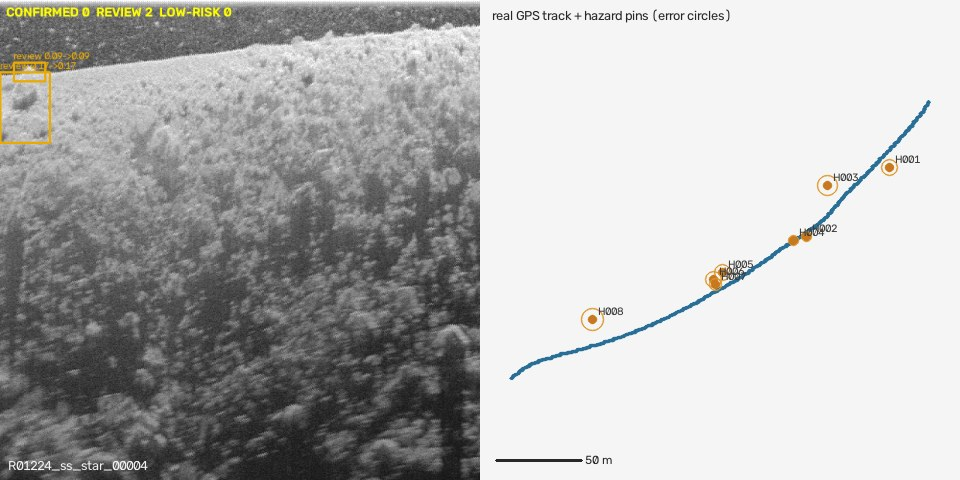

# STUDY-14 — A raw sonar recording with real GPS, straight into DEPTH

_`python -m src.cv_pipeline.humminbird report` · PINGMapper sample data (Bodine et al.; MIT code; Zenodo 10.5281/zenodo.6604666 archives Git-LFS pointers, the objects are fetched from the author's repository and kept only if their SHA-256 matches) · regenerated by the script — do not edit by hand_

Recording **R01224** — 9xx/11xx/helix (67-byte ping headers), fresh water, started 2013-10-24 23:28 UTC, 150.6 s, 3453 pings per side-scan channel at 455 kHz, 1479–1550 samples per ping. The decoded track lies at 36.8773–36.8788 °N, -111.5170–-111.5143 °E: **the Colorado River in Glen Canyon (Horseshoe Bend, Arizona)** — not the Mississippi recording the Zenodo text describes (that one is the ~216 MB `Test-Large-DS`, not downloaded).

## 1. Are the decoded numbers physically right? (no labels needed)

| check | port | starboard | reading |
|---|--:|--:|---|
| malformed pings skipped | 0 | 0 | every ping starts with the marker and ends its header correctly |
| record numbers / times monotonic | True / True | True / True | |
| GPS speed ÷ speed field | 0.1028 | 0.1028 | the field is in **0.1 m/s** (correlation 0.946) |
| \|course over ground − heading\| median / p90 | 2.4° / 6.0° | 2.4° / 6.0° | heading is in 0.1°; the p90 becomes the geotag heading error |
| depth field (min / median / max) | 1.0 / 4.2 / 6.6 m | | the field is in **decimetres** (confirmed below) |
| port vs starboard fixes at the same time | 0.0 m apart | | both channels share each ping's fix |

The track also lies on the river channel in satellite imagery (checked on the studio map).

## 2. A measured range scale

Metres per range sample = the sonar's own depth (m) ÷ the Stage-1 bottom-track altitude (samples), per chunk of 500 pings; the median over confident chunks is used, and its uncertainty is the larger of the robust spread and the gap to the beam-physics estimate (PINGMapper's formula: 0.108 m transducer, 455 kHz).

| | value |
|---|--:|
| **measured scale** (median, 11 confident chunks) | **2.19 cm / sample** |
| robust spread (1.4826·MAD / median) | 6.8% |
| beam-physics estimate | 1.88 cm / sample (14.5% away) |
| uncertainty carried into every error radius | **± 14.5%** |
| chunks > 3 robust σ from the median (bottom-track false picks) | 5 of 11 |

Per-chunk values (cm / sample): 1.58, 2.09, 2.1, 2.19, 2.19, 2.19, 2.28, 5.31, 6.71, 6.71, 29.94. Reading the depth field as centimetres would make the scale 10× smaller than the physics estimate — the decimetre reading is the only consistent one. With this scale, ground range is in real metres and shadow heights are `h/H × the sonar's measured depth` (the rule: metres only with a measured altitude).

## 3. The whole agent on it

- 14 frames (500 pings each, port + starboard) in **5.0 s** on this laptop — 30× faster than the recording.
- **8 review cards**, 0 auto-confirmed (no precision promise), P(pot) 0.15–0.44; heights 0.10–0.63 m where a shadow was measured.
- No crab pots are known in this reach of the Colorado River and there is no ground truth, so every card is a **false alarm or an unknown object on out-of-domain water**: **191 cards per hour of sonar** at the detector floor 0.05 — the review load this model would put on an analyst here (8 of 8 fit a 2-minute budget at the assumed 8 s per card).
- Every pin is placed from its **own ping's GPS fix and heading** plus the measured ground range; error radius = 3 m GPS (assumed) + range × (scale uncertainty + sin 6°): 3.0–6.7 m here.

## Limits

- One 2.5-minute recording from one unit; the scale method needs a confident bottom track (5 of 11 chunks were false picks here — reported, not hidden).
- Frames are resized to 640×640 like the training data (an assumption about the Roboflow export).
- Positions are consumer GPS (± a few metres, assumed) — good enough to send a boat, not a survey-grade map.

---
_Regenerated by the script; do not edit by hand._
