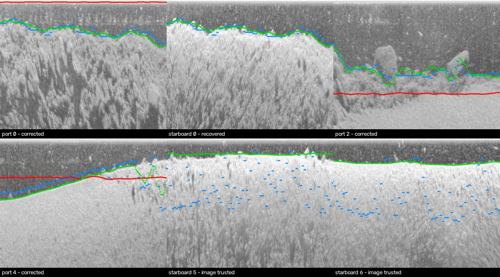
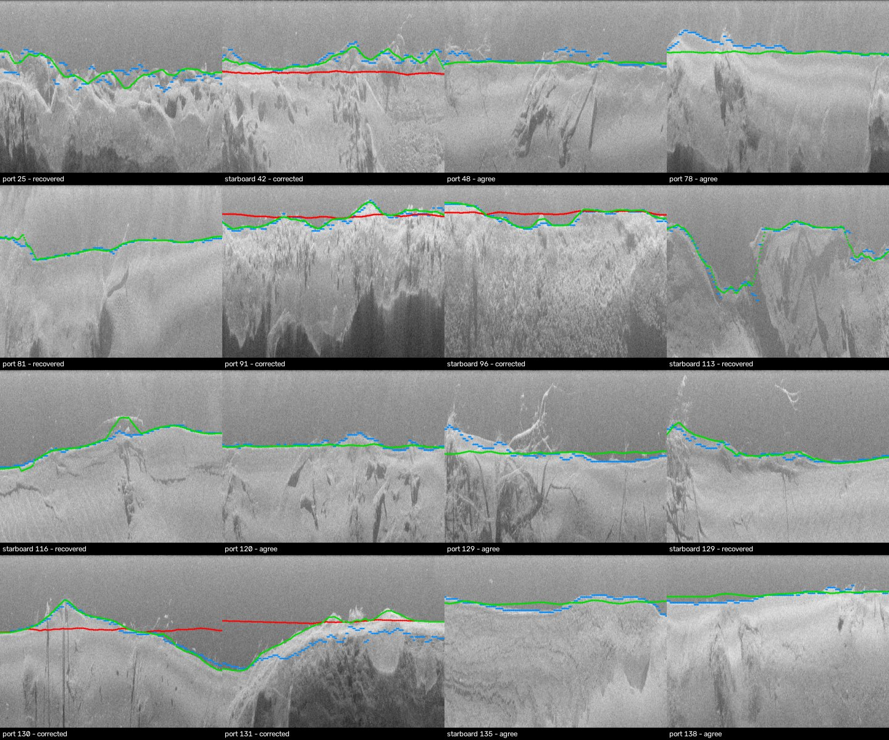

# STUDY-16 — The agent cross-checks OpenCV's seabed track against the depth sounder

_`python -m src.agentic.study_sensor` · thresholds set on the design recording only · the fresh recording is checked once against criteria written into the script before its first run · regenerated by the script — do not edit_

**Why.** Every metre DEPTH reports on a raw recording hangs on one number per ping: the sonar altitude. It sets the ground range (where a pin goes), heights in metres (`h/H × altitude`) and the range scale itself. Stage 1 reads it off the image with OpenCV; the ping headers carry an independent depth sounder. On the design recording **neither is always right**: the tracker locked onto the transducer ring-down (8 samples against ~117) *with confidence 0.99*, and in the last third the sounder lost lock and jumped between ~1.5 m and ~6 m from one reading to the next. Picking one sensor by rule is wrong either way.

**What the agent does** (`src/agentic/sensor_check.py`, per 500-ping chunk): OpenCV bottom track → is the sounder steady? → do they agree? → on a conflict, **re-run the OpenCV tracker** inside a window the steady sounder sets → accept it only if the edge is coherent (smooth ping to ping, ≥ 2× the speckle gradient) → with an unsteady sounder, trust a coherent image edge and flag the sounder → otherwise re-track inside the **other channel's** accepted line (same pings) → otherwise **not measured** (slant range, widened error radius, no metres). Then it **re-fits the range scale** from sounder-backed chunks and re-checks every chunk until the scale stops moving. Every call, skip and verdict is an `AgentStep` in the trace and the survey's Agent tab.

## Design recording — R01224 (9xx/11xx/helix, 455 kHz, 150.6 s)

_Red: OpenCV tracker alone · blue: the sounder's altitude at the final scale · green: what the agent accepted._

| chunk | sounder | tracker alone (samples, conf, error vs sounder) | agent's verdict | source | altitude used |
|---|---|---|---|---|---|
| port 0 | 2.4 m, spread 0.304 | 8.0, 0.99, 93% | **corrected** | sounder-guided re-track | 2.4 m |
| port 1 | 4.0 m, spread 0.184 | 182.4, 0.88, 12% | **agree** | tracker | 4.0 m |
| port 2 | 5.6 m, spread 0.158 | 354.4, 0.9, 28% | **corrected** | sounder-guided re-track | 5.6 m |
| port 3 | 5.2 m, spread 0.063 | no track | **recovered** | sounder-guided re-track | 5.2 m |
| port 4 | 3.1 m, spread 0.222 | 148.2, 0.92, 22% | **corrected** | sounder-guided re-track | 3.1 m |
| port 5 | 4.0 m, spread 0.933 **(lost lock)** | 59.6, 0.97, 70% | **image trusted** | tracker | 1.23 m |
| port 6 | 5.2 m, spread 0.892 **(lost lock)** | 97.9, 1.0, 63% | **image trusted** | tracker | 2.01 m |
| starboard 0 | 2.4 m, spread 0.304 | no track | **recovered** | sounder-guided re-track | 2.4 m |
| starboard 1 | 4.0 m, spread 0.184 | 182.8, 0.91, 12% | **agree** | tracker | 4.0 m |
| starboard 2 | 5.6 m, spread 0.158 | 255.4, 0.67, 9% | **agree** | tracker | 5.6 m |
| starboard 3 | 5.2 m, spread 0.063 | 248.1, 0.54, 8% | **agree** | tracker | 5.2 m |
| starboard 4 | 3.1 m, spread 0.222 | 136.1, 0.87, 26% | **corrected** | sounder-guided re-track | 3.1 m |
| starboard 5 | 4.0 m, spread 0.933 **(lost lock)** | 59.6, 0.89, 70% | **image trusted** | tracker | 1.23 m |
| starboard 6 | 5.2 m, spread 0.892 **(lost lock)** | no track | **image trusted** | cross-channel re-track | 2.0 m |

Scale: first estimate 2.193 cm/sample → 2.056 → 2.033 (2 iteration(s)); beam-physics estimate 1.875 cm/sample (gap 14.5% → 7.8%).

| criterion | registered | measured | |
|---|---|---|---|
| C1 port vs starboard (independent images) | loop median ≤ 5% and ≤ tracker alone | loop 0.0108 over 7 pairs · tracker alone 0.0485 over 4 pairs | **PASS** |
| _C1 post-hoc (added after the run): same pairs_ | — | _on the 4 pairs where the tracker alone had both sides: tracker 0.0485, loop 0.009; on the 3 pairs only the loop could measure: 0.0138_ | |
| C2 scale stable across halves | gap ≤ reported uncertainty | 2.058 vs 2.033 cm/sample: gap 1.2%, uncertainty ±10.2% | **PASS** |
| C3 gross tracker failures caught | none accepted as is | 1 chunk(s) > 50% off a steady sounder → 1 corrected; accepted as is: 0 | **PASS** |

## Fresh recording — Rec00002 (solix, 1050 kHz, 60 min, 280 chunks) — run once

Verdicts: 104 agree, 39 corrected, 137 recovered, 0 image trusted, 0 not measured · 1 scale iteration(s) · 24 s on this laptop for a 60-min recording.

| criterion | registered | measured | |
|---|---|---|---|
| C1 port vs starboard (independent images) | loop median ≤ 5% and ≤ tracker alone | loop 0.0139 over 139 pairs · tracker alone 0.008 over 45 pairs | **FAIL** |
| _C1 post-hoc (added after the run): same pairs_ | — | _on the 45 pairs where the tracker alone had both sides: tracker 0.008, loop 0.0074; on the 94 pairs only the loop could measure: 0.0202_ | |
| C2 scale stable across halves | gap ≤ reported uncertainty | 1.984 vs 2.002 cm/sample: gap 0.9%, uncertainty ±5.0% | **PASS** |
| C3 gross tracker failures caught | none accepted as is | 3 chunk(s) > 50% off a steady sounder → 3 corrected; accepted as is: 0 | **PASS** |

_16 chunks drawn at random (seed 0, stratified by verdict). Red: tracker alone · blue: sounder · green: accepted._

**Visual audit (developer, not blind):** in 16 of 16 randomly drawn chunks the accepted (green) line sits on the first seabed return, including the 4 corrected ones where the tracker alone (red) cut through the water column or the bed; on this river bed sunken trees (snags) rise above the seabed and the line follows the bed beneath them.

Scale on the fresh recording: 1.997 → 1.995 cm/sample, ±5.0%. The beam-physics cross-check is not applied at 1050 kHz (the formula's transducer length is for the 455 kHz unit).

## Decision

**On by default for raw recordings.** C2 and C3 held on the fresh recording; C1 **failed as registered** (the loop's port/starboard median 1.39% is under the 5% limit but above the tracker alone's 0.80%). The registered comparison used different pair sets — the tracker alone has a pair only where both sides found a track (45 easy pairs). On those same pairs the loop is not worse (0.74% vs 0.80%, post-hoc); the rest are the 94 pairs only the loop could measure (2.02%). The tracker alone gave a seabed on 143 of 280 chunks (with 3 gross failures it would have used silently); the agent resolved 280 and accepted none of those failures. The failed criterion is kept in this report, not re-registered.

## Limits

- No surveyed seabed: the checks are consistency between independent measurements (two transducers, the sounder, two halves of a recording) and published overlays, not ground truth.
- Two recordings from two units; thresholds are design constants from one of them.
- Port and starboard coincide only over a flat bed; a sloping bank legitimately separates them, so C1 is an upper bound on tracking error, not a measurement of it.

---
_Regenerated by the script; do not edit by hand._
