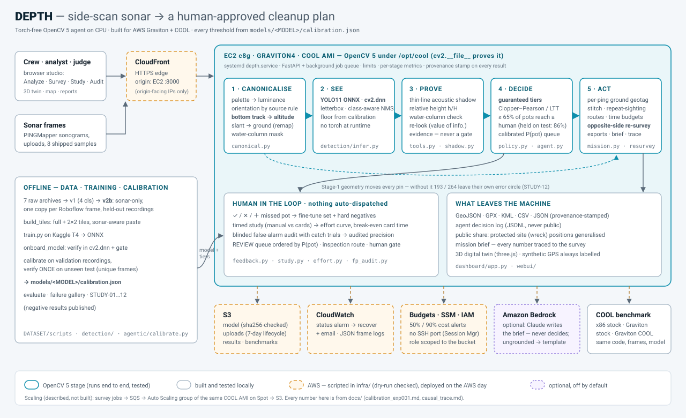

# DEPTH — Technical Report (draft)

**Side-scan sonar → a human-approved cleanup plan for ghost fishing gear and wreck debris**
OpenCV AI Competition 2026 · Team Syndicate (solo — Madhesh) · Tracks: **Agentic Vision**, **Best Use
of COOL** · Code: <https://github.com/madhesh60/depth> (AGPL-3.0)

> Draft of 2026-09-26. Every number names its split and links the script-generated report it comes
> from. Items marked **⏳ pending** are measurements that have not been taken yet; they are left
> empty rather than estimated.

---

## 0. Summary

A sonar debris detector alone is not a tool a cleanup crew can rely on: it misses things silently and
its false alarms cost boat time. DEPTH wraps one in an **OpenCV 5 agent** that measures the sonar
itself, proves or doubts each find with physical evidence, sorts finds into **tiers with calibrated
statistical promises**, and turns them into routes, second-look passes and reports. A human approves
everything that leaves the machine. It runs torch-free on CPU (OpenCV 5 `cv2.dnn`), built for **AWS
Graviton + COOL**.

| claim | evidence |
|---|---|
| **≥ 65% of pots reach a human** (95% confidence), fit on held-out recordings and verified once on unseen test: **86.2% (LCB 80.5%)** | [`calibration_exp001.md`](calibration_exp001.md) |
| Stage 1 measures the sonar's altitude without labels; port and starboard agree to **1.6 px** (random pairs 5.3 px) | [`stage1_canonical.md`](stage1_canonical.md) |
| OpenCV output changes the agent's actions: without Stage 1, **193 of 264** pins leave their own error circle and 13 of 63 re-survey passes regroup; the shadow changes no decision (evidence only) | [`causal_trace.md`](causal_trace.md) |
| Break-even analyst time: DEPTH meets the promise faster than manual review if a card takes **< 7.95 s** | [`effort_curve.md`](effort_curve.md) |
| Full product path **238 ms/frame p50** on a laptop CPU; one survey-hour of sonar in **43 s** | [`cool_benchmark.md`](cool_benchmark.md) |

---

## 1. Problem and users

**Problem.** Lost crab pots and other derelict gear keep fishing ("ghost fishing"). Wreck debris is a
navigation and snag hazard. Both show up in **side-scan sonar**, which survey teams already collect.
Finding them means an analyst scrolling through hours of sonograms. Public detectors exist, but they
are imperfect: on the crab-pot sonar in our data, the recall ceiling of the best model is 0.72–0.86
depending on the recording.

**Users.**
- **Cleanup NGOs and fisheries agencies** plan recovery trips.
- **Survey analysts** review the sonar.
- **Boat crews** go to the coordinates.

Their question is not "what is the mAP?" but "how many real pots will we miss, how much of my time will
this take, and where exactly do I send the boat?"

**Design goal.** Make the detector **dependable** rather than just more accurate:

- promises that can be checked;
- evidence on every card;
- compute, analyst minutes and boat time spent only where they can change the outcome;
- no action without a person;
- every correction captured as a training label.

---

## 2. Architecture



The **runtime** processes each frame through five stages, all OpenCV 5 on CPU:

1. **Stage 1 — canonicalise** (`src/cv_pipeline/canonical.py`).
   - Palette → luminance.
   - Orientation from a source rule; unknown sources are *not measured*, never guessed.
   - **Bottom tracking** gives the sonar altitude per ping. It scans each ping for the first seabed return, then smooths across pings.
   - Slant → ground range via `cv2.remap`.
   - Water-column mask.
2. **See** — YOLO11 exported to ONNX and run by `cv2.dnn` (letterbox, class-aware NMS). The per-class floors come from `calibration.json`.
3. **Prove** — per candidate:
   - thin-line **acoustic shadow**;
   - **relative height** h/H against the *tracked* altitude;
   - water-column check;
   - a value-of-information re-look.

   Evidence goes on the human's card. It is never a silent gate (STUDY-03/04).
4. **Decide** — **guaranteed tiers** (§4.2): CONFIRMED / REVIEW / LOW-RISK. A calibrated P(pot) orders the review queue.
5. **Act** (survey level):
   - per-ping ground-range geotags with error radii;
   - chunk-boundary stitching and repeat-sighting merging;
   - nearest-neighbour recovery and inspection routes;
   - analyst-minute and boat-minute budgets;
   - **opposite-side re-survey passes**: each uncertain target predicts the bearing its shadow must flip to, a test that speckle cannot pass;
   - GeoJSON / GPX / KML / CSV / JSON exports with a **provenance stamp**, an agent **decision log** (JSONL) and a **mission brief**.

**Serving.** FastAPI with a background job queue, upload limits and per-stage metrics. A zero-build web
studio has four modes:

- **Analyze:** one frame with its evidence and the agent's-eye view.
- **Survey:** map, routes, re-survey passes, the "without Stage 1" counterfactual, and the **3D digital twin** (three.js: seabed in true ground range, the sonar at its tracked altitude, the acoustic triangle each height is measured from).
- **Study:** timed user study.
- **Audit:** blinded false-alarm audit.

A guided 60-second demo walks through the whole path.

**Model onboarding.** Every threshold lives in `models/<MODEL>/calibration.json`, so a new model plugs
in with one command. `onboard_model` verifies the ONNX in `cv2.dnn`, gates weak models, calibrates on
validation recordings and verifies on test. Training runs on Kaggle; the runtime never imports torch.

---

## 3. OpenCV 5 implementation — where OpenCV does the work

| stage | OpenCV 5 operations | what the result changes |
|---|---|---|
| Stage 1 | `cvtColor`, `medianBlur` / `blur` + per-ping reductions for the bottom track, `remap` (slant → ground), `resize` | geotags, error radii, relative heights, water-column flags, re-survey geometry (§4.3) |
| See | `dnn.readNetFromONNX`, `blobFromImage`, `dnn.NMSBoxesBatched` | candidates, tiers, P(pot), the queue |
| Prove | crops + upscales for the re-look, `createCLAHE`, thin-line shadow statistics on the canonical view | card evidence; the re-look is spent only where it can change a tier or queue position |
| Act | (plain geometry on Stage-1 output: ground range → metres → lat/lon — not an OpenCV call) | routes, passes, exports |
| Training data | `seamlessClone` for sonar-aware copy-paste (`build_tiles.py --paste`) | EXP-002 training set |
| Display | agent's-eye view, overlays, JPEG encode, twin texture | what the human sees |

The runtime has **no torch dependency**. The same ONNX is evaluated in `cv2.dnn`, so deploy-time
numbers equal evaluation numbers ([`eval_exp001.md`](eval_exp001.md)).

---

## 4. Evaluation

All numbers are on **unique frames** (Roboflow augmentation copies removed), and the split is named next to every number.

### 4.1 Detector — EXP-001 (YOLO11s, 640 px, dataset v1)

| | value | split |
|---|--:|---|
| mAP@0.5, all classes | 0.827 — **inflated** by easy optical/wreck classes | v1 test |
| **crab pots on sonar — AP@0.5 / recall** | **0.473 / 0.599** | v1 test |
| recall ceiling (any proposal ≥ 0.05) | 0.72 (Rec19) – 0.86 | calibration / verification |

We report the crab-pot sonar number because it is the one that matters, not the aggregate
([`eval_exp001.md`](eval_exp001.md)).

### 4.2 The agent's promises (Agentic Vision: task success)

Tiers are fit on the **calibration split** (held-out recording Rec19) with Clopper–Pearson /
Learn-Then-Test and **verified once** on the verification split
([`calibration_exp001.md`](calibration_exp001.md)):

- **Recall promise ≥ 65%** (95% confidence). Verified: **86.2%, lower confidence bound 80.5% — held.**
- **No precision promise is supportable** with EXP-001, so nothing is auto-confirmed and every find goes to a human. DEPTH says what it *cannot* promise.
- Re-look vs plain confidence on unseen data: the re-look **did not** beat confidence (STUDY-07). The shipped policy therefore spends 1 inference per frame, and the value-of-information agent records the re-looks it chose not to make.

### 4.3 Does OpenCV output change what the agent does? (required evidence)

[`causal_trace.md`](causal_trace.md) (STUDY-12) runs the same survey three ways: the full product,
with Stage-1 geometry withheld, and with the shadow withheld. It then diffs every downstream
decision. Results on v1 test, 80 unique frames, 264 hazards:

| downstream decision | without Stage 1 | without shadow |
|---|---|---|
| tier flips · queue order (Kendall τ) · budget picks | 0 · 1.0 · 0 | 0 · 1.0 · 0 |
| geotag shift, median / max | **8.6 / 15.6 m** | 0 |
| pins pushed outside their own error circle | **193 of 264** | 0 |
| re-survey passes unchanged | 50 of 63 | 63 of 63 |

Stage 1 is not a gate, so it changes no tier. It does decide **where the boat goes**. The shadow
changes nothing, by design. The report also prints one hazard's full chain: bottom track → `cv2.dnn`
→ tier → P(pot) → queue rank → budget → inspection stop → re-survey pass with its predicted shadow
flip. The product shows this live with the map's **"⊘ without Stage 1"** toggle. Every survey also
exports its decision log.

### 4.4 Human effort

The effort curve ([`effort_curve.md`](effort_curve.md)) compares three review modes:

- **manual review** (every frame);
- **a confidence-sorted list**;
- **DEPTH's cards.**

It reports the **break-even card time: 7.95 s**. DEPTH beats manual review at the recall promise
whenever a card takes less than this.

- **⏳ pending:** the timed, counterbalanced study built into the app (Study tab, [`user_study.md`](user_study.md)) will replace the assumed 8 s/card with a measurement.
- **⏳ pending:** the blinded false-alarm audit (Audit tab) will measure how many "false alarms" are unlabelled real objects. Catch trials check the auditors themselves.

### 4.5 Failure cases (measured, not assumed)

On the verification split, 19 of 138 pots (14%) never reach a human
([`failure_gallery.md`](failure_gallery.md), with contact sheets):

- **32% of missed pots touch the frame edge**, against 11% of found pots;
- missed pots have lower contrast and sit farther in range;
- they are **not** smaller.

We tried seam inference across chunk boundaries (STUDY-11b): **no recall gain, not shipped**
([`seam_inference.md`](seam_inference.md)). Most of these edges are augmentation crops, which dataset
v2b removes.

### 4.6 Runtime and COOL

| run | host | total p50 | fps | survey-hour compute |
|---|---|--:|--:|--:|
| full product path | laptop x86, stock OpenCV 5, 8 threads | 238 ms | 3.9 | 43 s (RTF 0.012) |
| full product path, 1 thread | laptop x86 | 523 ms | 1.9 | 89 s |
| **⏳ pending:** x86 stock · Graviton stock · **Graviton COOL** | EC2 c7i / c8g | — | — | — |

The 3-way benchmark ([`infra/README.md`](../infra/README.md)) uses the same code, the same frames and
the same model (all sha256-pinned), with threads pinned per run. A run counts as COOL only if
`cv2.__file__` resolves under `/opt/cool`. It times the **product workload per stage** plus a
CV-only workload that isolates where COOL acts.

---

## 5. AWS deployment

The deployment is scripted, dry-run checked, and executed on the AWS day:

- **EC2 c8g** (Graviton4) launched from the **COOL AMI**, running `depth.service` under systemd with the COOL interpreter.
- Web dependencies are installed with `pip --target`; **the COOL venv is never modified**.
- **CloudFront** provides HTTPS, with the origin restricted to CloudFront's IP ranges.
- **S3** holds the model (sha256-checked), uploads (7-day lifecycle) and results.
- **CloudWatch** status alarms trigger auto-recovery plus email, and collects JSON frame logs.
- **Budgets** alert at 50% and 90% of spend.
- Access goes through **SSM** only (no SSH port), under an **IAM** role scoped to the bucket.

`infra/deploy_aws.sh` is a dry run by default. It sets the budget alarm before creating anything.

**Optional:** Amazon Bedrock (Claude) rewrites the mission brief. It writes, never decides: its text is
shown only if every number and ID traces back to the survey, otherwise the template is served
(`src/agentic/brief.py`).

**Scaling path (described, not built):** survey jobs → SQS → an Auto Scaling group of the same COOL AMI
on Spot → S3.

**⏳ pending:** the live endpoint URL and the 24-hour soak test.

---

## 6. Limitations (stated in the product, not hidden)

- **Scope.** One bay's crab pots and one sonar family. Cross-sonar results are pending EXP-002, the first leakage-free model for that test.
- **Recall ceiling.** EXP-001's ceiling caps the promise at 65%; EXP-002 (v2b, 1024 px, tiles) is the lever. The Kaggle kit is ready ([`exp002_kaggle.md`](exp002_kaggle.md)).
- **Calibration.** Calibration uses a single recording, whose frames are correlated. That is why the promise is verified on a separate split.
- **Labels.** Labels are incomplete, so precision is a lower estimate (the audit will quantify this).
- **GPS.** The public frames carry no GPS. The demo track is synthetic and labelled as such everywhere, including the counterfactual's metres, which use the demo range scale.
- **Heights.** Heights are relative (h/H). Metres need a measured altitude in metres.
- **Effort.** Analyst seconds per card are assumed until the study measures them.

## 7. Responsible use

- **Human control.** Nothing is dispatched automatically. Every plan carries `human_approval_required`, re-survey passes are "PLANNED", and LOW-RISK finds are kept for audit, never deleted.
- **Protected sites.** Wrecks can be war graves or heritage sites. Public shares generalise their positions to about 1.1 km and drop passes that would point at them. The decision log is never public.
- **Honest geotags.** No GPS means no coordinates. Unknown orientation means a swath-wide error radius. Synthetic tracks are stamped on every export.
- **Provenance.** Every result carries the model and calibration hashes, the OpenCV build (COOL or stock), the code commit and the host.
- **Language models** may narrate but never decide, and their numbers are machine-checked.
- **Data.** CC-BY-SA sample frames are shipped with attribution. Datasets are not redistributed; their builders are in `DATASET/scripts/`.

Details: [`responsible_use.md`](responsible_use.md) · [`model_card.md`](model_card.md) ·
[`dataset_card.md`](dataset_card.md).

## 8. What did not work (published)

- **STUDY-01** — classical ROI gate: no gain; retired.
- **STUDY-03/04** — the acoustic shadow as a filter hurts recall; kept as evidence only.
- **STUDY-07** — re-look vs confidence: no gain on unseen data. The old test-tuned "CONFIRMED 0.737" is 0.58 on unseen data, and was retired.
- **STUDY-08** — range-gain detector input: no gain for EXP-001.
- **STUDY-11b** — seam inference: no recall gain.

Log: [`experiments.md`](../experiments.md).

## 9. Reproduce

```bash
pip install -r requirements.txt && pytest -q                 # 113 tests
python -m uvicorn src.dashboard.app:app --port 8000          # studio → "▶ 60-s demo"
python -m src.agentic.calibrate                              # fit + verify the guarantees
python -m src.detection.evaluate                             # deploy-faithful detector eval
python -m src.agentic.study_causal --frames <v1>/test/images --limit 80   # STUDY-12
python -m src.bench.product_bench --label <host>             # benchmark this machine
```
